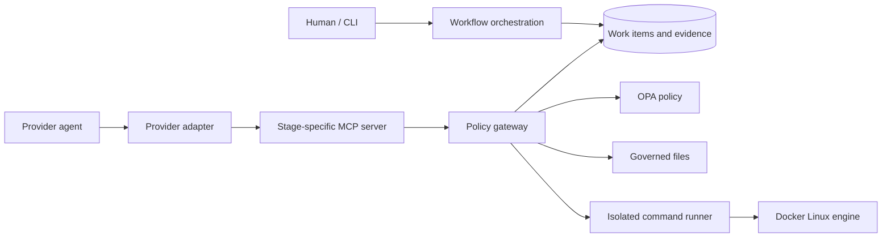

# Architecture

AI Delivery Workflow separates lifecycle decisions, enforcement, provider integration, and evidence. Providers never receive direct authority from documentation or prompts; the controller derives a capability manifest and checks every operation at the server boundary.



## Components

| Area | Responsibility |
| --- | --- |
| `config` | Repository detection, initialization, runtime settings, toolchain preparation, upgrades |
| `projects` and `governance` | Project ownership, path scope, commands, risk and validation policy |
| `work-items` and `lifecycle` | State transitions, approvals, validation records, reviews, completion |
| `capabilities` | Deterministic permissions from project policy, lifecycle state, role, and risk |
| `enforcement` | Sessions, bindings, drift checks, files, containers, review isolation, promotion |
| `providers` | Codex, Claude, Copilot, and generic MCP configuration and launch behavior |
| `mcp` | Stage-specific tools and protocol handling |
| `evidence` | Ordered, hash-chained audit events |
| `schemas` | Strict validation at persistence and receipt boundaries |

The `enforcement/bindings` module owns candidate handoff validation and review confirmation hashing. This keeps the same binding rules across local MCP calls, isolated exports, workflow recording, routing, and completion.

## Persisted data

Tracked repository data:

```text
.ai-delivery/
  projects.json
  governance.json              # for a root project
  work-items/<id>/
    work-item.json
    discovery.md
    specification.md
    plan.md
    architecture-impact.md
    review.md
    delivery-receipt.json
    archive/<session-id>/
  evidence.jsonl

<child-project>/.ai-delivery/governance.json
```

Session control directories live outside the consumer repository. They contain session state, provider preparation, candidate workspaces, command receipts and logs, `handoff.md`, review findings, and import journals. Credentials are not persisted in these receipts.

The project registry permits one root project or multiple non-overlapping sibling projects. Every load repeats canonical-path and ownership checks. Each project's governance file is authoritative for allowed paths, commands, risk rules, confirmations, and validation.

## Session and candidate flow

1. The workflow creates a session bound to the work item, project, epoch, lifecycle state, artifacts, governance, registry, capability manifest, baseline, and expiry.
2. The provider adapter writes a content-bound preparation receipt and exposes one `ai-delivery` MCP server.
3. The agent reads and mutates only through authorized MCP operations.
4. The implementation agent submits a handoff bound to the current candidate.
5. Validation executes declared commands in restricted containers and records receipts.
6. A separate review session receives a read-only candidate and the verified handoff.
7. Review recording verifies the submission and handoff hashes before storing the decision.
8. Standard and High Risk promotion applies the reviewed candidate through a journaled patch operation. Lightweight completion verifies the host tree already matches the candidate.
9. Completion archives session evidence and closes the active session.

## Isolation

| Profile | Candidate location | Provider execution | Delivery |
| --- | --- | --- | --- |
| Lightweight | Host project | Credential-filtered local provider | Host snapshot verification |
| Standard | External isolated copy | Credential-filtered local provider | Confirmed patch promotion |
| High Risk | Docker volume | Digest-pinned container | Confirmed patch promotion |

Validation containers use a read-only root filesystem, resource limits, no inherited credentials, no Docker socket, and `--network=none`. The host CLI is the only component allowed to use the Docker socket.

Codex and Claude receive short-lived broker tokens. The broker holds the DPAPI-protected upstream credential, restricts provider and model, and omits prompts, responses, and secrets from its logs. Copilot uses its supported VS Code login through a restricted proxy allowlist and a separate writable home volume.

## Consistency model

Work items and sessions use atomic replacement plus optimistic revisions under filesystem locks. Stale writers fail instead of overwriting newer state. Evidence appends hold a separate lock, verify the existing chain, and allocate sequence and previous hash atomically.

The drift tripwire compares expected host and candidate snapshots at operation boundaries. Unexpected mutation suspends the work item. Resynchronization closes the old candidate and invalidates its validation and review evidence.

Evidence detects edits, deletion from the middle, and reordering. It does not prevent tail truncation without externally anchoring the latest head hash, and human confirmation is a local interactive claim rather than cryptographic identity proof.

## Extension rules

- Add lifecycle behavior to `work-items`; keep transition rules in `lifecycle`.
- Add persisted fields to both TypeScript types and JSON schemas. New fields must remain optional when historical records need to load.
- Put shared candidate and receipt hashing in `enforcement/bindings`.
- Add provider-specific behavior behind `ProviderAdapter`; do not fork lifecycle or evidence logic.
- Treat MCP descriptions as usability text. Authorization always belongs in the gateway and policy layer.
- Keep release receipt semantics in `validation` so scripts and schema parsing share one rule set.
